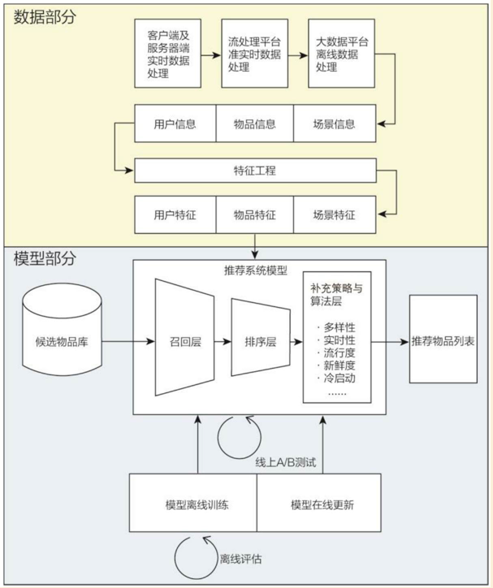
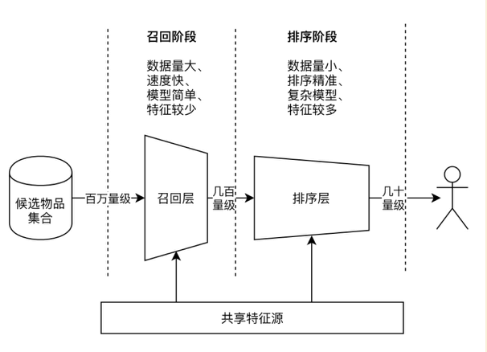
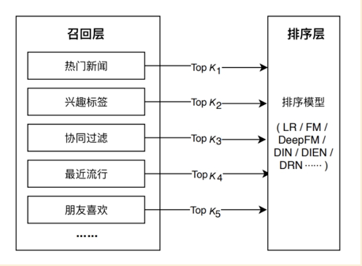

# 推荐系统技术解决方案

### 目录：

- 用户行为数据及协同过滤算法
- 推荐引擎的架构

## 1、用户行为数据及协同过滤算法

推荐系统分为两个部分：数据部分和模型部分。“数据和信息”部分逐渐发展为推荐系统中融合了数据离线批处理、实时流处理的数据流架构；“”算法和模型部分则进一步细化为推荐系统中集合了训练、评估、部署、线上推断为一体的模型架构。推荐系统的技术架构示意图如下：

推荐系统的数据部分主要负责“用户”、“物品”、“场景”的信息收集与处理。得到原始的数据信息后，推荐系统的数据处理系统会将原始数据进一步加工，加工后的数据出口主要有三个：

1. 生成推荐模型所需要的样本数据，用于算法模型的训练和评估；
2. 生成推荐模型服务所需的“特征”，用于推荐系统的线上推断；
3. 生成系统监控所需的统计型数据；

**构建推荐系统特征工程的原则：**

特征的本质其实就是对某个行为过程相关信息的抽象表达。

### 用户行为数据

用户的潜在兴趣、用户对物品的真实评价均包含在用户的行为历史中。不同场景下用户行为数据的例子：

|   业务场景   |       显性反馈行为       |       隐性反馈行为       |
| :----------: | :----------------------: | :----------------------: |
| 电子商务网站 |       对商品的评分       | 点击、加入购物车、购买等 |
|   视频网站   |   对视频的评分、点赞等   |  点击、播放、播放时长等  |
|  新闻类网站  |       赞、踩等行为       |  点击、评论、停留时间等  |
|   音乐网站   | 对歌曲、歌手、专辑的评分 |    点击、播放、收藏等    |

### 属性、标签类数据

把属性类和标签类数据归位一组进行讨论，因为它们都是直接描述用户或则物品的特征。属性和标签的主体可以是用户，也可以是物品，它们的来源非常多样化，大体可分为下面几类：

| 主体 |                类别                |          来源          |
| :--: | :--------------------------------: | :--------------------: |
| 用户 | 人口属性数据（性别、年龄、住址等） |    注册信息、第三方    |
| 用户 |            用户兴趣标签            |        用户选择        |
| 物品 |              物品标签              |  用户或系统管理员添加  |
| 物品 |       物品属性（类别、价格）       | 后台录入、第三方数据库 |

用户属性、物品属性、标签类数据是最重要的描述型特征。

### 上下文信息

上下文信息是描述推荐行为产生的场景的信息。最常用的上下文信息是“时间”和通过GPS获得的“地点”信息。引入上下文信息的目的是尽可能地保存推荐行为发生的场景。如果不引入上下文特征，则推荐系统无法捕捉到与场景有关的有价值的信息。

### 统计类特征

统计类特征是指通过统计方法计算出的特征，例如：物品热门程度、物品流行程度等。

**个性化推荐的主要难点：**

1. 自然语言难以描述用户的兴趣；
2. 用户兴趣是不断变化的；
3. 用户不知道喜欢什么；

因此需要使用算法自动发掘用户的行为习惯，从用户的行为中预测用户的兴趣，从而给用户推荐能满足他们兴趣的物品。

用户行为在个性化推荐系统中一般分为两种：显性反馈行为和隐性反馈行为；显性行为包括用户明确表示对物品喜好的行为。隐性行为指的是哪些不明确反应用户喜好的行为，最具代表性的隐性行为就是页面浏览行为。

一般认为，新用户倾向于浏览热门的物品，因为他们对网站不熟悉，只能点击首页的热门物品，而老用户会逐渐开始浏览冷门的物品。

目前业界最著名、最广泛应用的算法是基于邻域的方法，主要包含下面两种算法：

1. 基于用户的协同过滤算法：

   这种算法给用户推荐和他兴趣相似的其他用户喜欢的物品；

2. 基于物品的协同过滤算法（**可能优先选择该算法**）：

   这种算法给用户推荐和他之前喜欢的物品相似的物品；

### **1、基于用户的协同过滤算法**

基于用户的协同过滤算法主要包括两个步骤：

1. 找到和目标用户兴趣相似的用户集合；
2. 找到这个集合中的用户喜欢的，且目标用户没有阅览过的物品推荐给目标用户；

步骤1的关键是计算两个用户的兴趣相似度。这里协同过滤算法主要利用行为的相似度计算兴趣的相似度。

得到用户之间的兴趣相似度之后，UserCF算法会给用户推荐和他兴趣最相似的K个用户喜欢的物品。

UserCF的覆盖率远远高于MostPopular，推荐结果相对MostPopular不太热门，同时可以发现参数K是UserCF的一个重要参数，它的调整对推荐算法的各项指标都会产生一定的影响。

存在的局限：

基于用户的协同过滤算法随着用户数量的扩大，计算用户兴趣相似度矩阵将越来越困难，其计算时间复杂度和空间复杂度的增长和用户数的增长接近于平方关系。

### **2、基于物品的协同过滤算法**

模型融合对提高评分预测的京都至关重要，本届讨论模型融合的两种不同技术。

#### 1、模型及联融合

及联融合很像Adaboost算法，和它类似，该算法每次产生一个新模型，按照一定的参数加到旧模型上去，从而使训练集误差最小化。

#### 2、模型加权融合

该算法是目前业界应用最多的算法，无论亚马逊、YouTube、Netflix，其推荐算法的基础都是该算法。

ItemCF算法并不利用物品的内容属性计算物品之间的相似度，它主要通过分析用户的行为记录计算物品之间的相似度。该算法认为：物品A和物品B具有很大的相似度是因为喜欢物品A的用户大多也都喜欢物品B。

基于物品的协同过滤算法可以利用用户的历史行为信息给推荐结果提供解释。例如：Hule在个性化视频推荐利用ItemCF给每个推荐结果提供了一个推荐解释，而用于解释的视频都是用户之前观看或者收藏过的。

### Hule的个性化视频推荐

基于物品的协同过滤算法主要分为两步：

1. 计算物品之间的相似度；
2. 根据物品的相似度和用户的历史行为数据给用户生成推荐列表；

在协同过滤中两个物品产生相似度是因为它们共同被很多用户喜欢，也就是说每个用户都可以通过他们的历史兴趣列表给物品“贡献”相似度。

和UserCF算法类似，用ItemCF算法计算物品相似度时也可以首先建立用户-物品到排表（即：对每个用户建立一个包含他喜欢的物品的列表）。一般来说，同系列的电影、同角色的电影、同风格的电影、同国家和地区的电影会有较大的相似度。

**算法各项指标的评估**

- 精度（准确率和召回率）

  ItemCF推荐结果的精度也是不和K成正相关或负相关的，因此选择合适大小的K对于获得最高精度是非常重要的；

- 流行度

  和UserCF不同，参数K对ItemCF推荐结果流行度的影响也不是完全正相关的。随着K的增加，结果流行度会逐渐提高，但当K增大到一定程度后，流行度就不再有明显的变化了。

- 覆盖率

  K增加会降低系统的覆盖率。

#### UserCF和ItemCF的综合比较：

ItemCF是相对较新的算法，在著名的电子商务网站亚马逊和DVD租赁网站Netflix中得到了广泛的使用。

UserCF给用户推荐哪些和他有共同兴趣爱好的用户喜欢的物品，而ItemCF给用户推荐那些和他之前喜欢的物品类似的物品。UserCF算法的推荐结果着重于反映和用户兴趣相似的小群体的热点，而ItemCF的推荐结果着重于维系用户的历史兴趣。换句话说：UserCF的推荐更社会化，反映了用户所在的小型兴趣群体中物品的热门程度，而itemCF的推荐更加个性化，反映了用户自己的兴趣传承。

在新闻网站中，用户的兴趣不是特别细化，绝大多数用户都喜欢看热门的新闻，即使是个性化，也是比较粗粒度的。个性化新闻推荐更加强调新闻的热点和实效性，个性化相对于这两点略显次要。因此，UserCF可以给用户推荐和他有相似爱好的一群其他用户今天都在看的新闻，这样在抓住热点和实效性的同时，保证了一定程度的个性化。

UserCF适合用于新闻推荐的另一个原因是从技术角度度量的。因为作为一个物品，新闻的更新非常快，每时每刻都有新内容出现，而ItemCF需要维护一张物品相关度的表，如果物品engine很快，那么这张表就需呀很快更新，这在技术上很难实现。绝大多数物品相关度表都只能做到一天一次更新，这在新闻领域是不可以接受的。

UserCF只需呀用户相似度表，虽然UserCF对于新用户也需要更新相似度表，但在新闻站点中，物品的更新速度远远快于新用户的加入速度，而且对于新用户，完全可以给她推荐最热门的新闻，因此UserCF显然是利大于弊。

但在图书、电子商务、电影等领域，比如亚马逊、豆瓣、Netflix中，ItemCF则能极大的发挥优势，这些网站的个性化推荐的任务是帮助用户发现和他研究领域相关的物品。

因此，ItemCF算法成为了这些网站的首选算法，此外，这些网站的物品更新速度不会特别快，一天一次更新物品相似度矩阵对它们来说不会造成太大的损失，是可以接受的。

从技术角度考虑，UserCF需要维护一个用户相似度的矩阵，而ItemCF需要维护一个物品相似度矩阵，从存储的角度来说，如果用户很多，那么维护用户兴趣相似度矩阵需要很大的空间；同理，如果物品很多，则维护物品相似度矩阵代价很大。

#### 在线实时推荐

UserCF和ItemCF在线服务算法需要将相关表缓存在内存中，然后可以在线进行实时的预测。以ItemCF算法为例，一旦用户喜欢了新物品，就可以通过查询内存中的相关表将和该物品相似的其他物品推荐给用户。因此，一旦用户有了新的行为，而且该行为被实时记录到后台的数据库系统中，它的推荐列表就会发生变化。

**推荐系统的推荐任务也有很多种类：**

- 将最新加入的物品推荐给用户；
- 将商业上需要宣传的物品推荐给用户；
- 给用户推荐不同种类的物品；

## **2、推荐引擎的架构**

推荐系统的模型部分将推荐过程分为召回层和排序层。在排序阶段一般会使用复杂模型，利用多特征进行精准排序，然而此过程中，如果直接对百万量级的候选集进行逐一判断，则计算资源和延迟都是在线服务过程无法忍受的。因此，需要加入召回过程，利用少量的特征和简单的模型或规则，对候选集进行快速筛选，减少精准排序阶段的时间开销。

- 召回层：

  待计算的候选集合大、速度快、模型简单、特征较少，尽量让用户感兴趣的物品在这个阶段被快速召回，保证相关物品的召回率；

- 排序层：

  首要目标是得到精准的排序结果。需处理的物品数量少，可利用较多特征，使用比较复杂的模型；

在设计召回层时，“计算速度”与“召回率”是矛盾的两个指标，在权衡计算速度与召回率之后，目前的工业界主流的召回方法是采用多个简单策略叠加的“多路召回策略”。

### 多路召回策略

以下图的信息流为例，展示了常用的多路召回策略策略，包括“热门新闻”、“兴趣标签”、“协同过滤”、“最近流行”、“朋友喜欢”等多种召回方法。其中，既包括一些计算效率高的简单模型，也包括一些基于单一特征的召回方法（如兴趣标签），还包括一些预处理好的召回策略（如：热门新闻、最近流行等）。

每一路召回策略都会拉回K个候选物品，对于不同的召回策略，K值可以选择不同的大小。这里的K值是超参数，一般需要通过离线评估加线上A/B测试的方式确定合理的取值范围。

推荐系统使用一种或几种用户特征，按照一种推荐策略生成一种类型物品的推荐列表，推荐引擎架构主要包括3部分：

1. 部分A负责从数据库或者缓存中拿到用户行为数据，通过分析不同的行为，生成当前用户的特征向量；
2. 部分B负责将用户的特征向量通过特征-物品相关矩阵转化为初始推荐物品列表；
3. 部分C负责对初始列表进行过滤、排名等处理，从而生成最终的推荐结果；

#### 生成用户特征向量

用户特征包括两种，一种是用户的注册信息中可以提取出来的，主要包括用户的人口统计学特征，可以将这些信息直接缓存在内存中，在推荐时直接拿到用户的特征数据并生成特征信息。除了这种特征，另一种特征主要从用户的行为中计算出来，本节着重讨论如何生成特征。

一个特征向量由特征以及特征的权重组成，在利用用户行为计算特征向量时，需要考虑以下因素：

- 用户行为的种类

  这些行为都会对物品特征的权重产生影响，但不同行为的影响不同，大多数时候很难确定什么行为更加重要，一般的标准就是用户付出代价越大的行为权重越高；

- 用户行为产生的时间

  一般来说，用户近期的行为比较重要，而用户很久之前的行为相对比较次要；

- 用户行为的次数

  用户对同一个物品的同一种行为次数也反映了用户对物品的兴趣，行为次数多的物品对应的特征权重越高；

- 物品的热门程度

### 特征-物品的相关推荐

在得到用户的特征向量后，可以根据离线的相关表得到初始的物品推荐列表。离线相关表可以存储在MySQL中。在线使用的特征-物品相关表一般都不止一张。

对于一个推荐引擎，可以在配置文件中配置很多相关表以及它们的权重，而在线服务在启动时会将这些相关表按照配置的权重相加，然后将最终的相关表保存在内存中，而在给用户进行推荐时，用的已经是加权后的相关表了。

从上面的架构图可以看出，特征-物品相关推荐模块还可以接受一个候选物品集合。候选物品集合的目的是保证推荐结果只包含候选物品集合中的物品。

特征-物品相关推荐模块除了给用户返回物品推荐列表，还需要给推荐列表中的每个推荐结果产生一个解释列表，表明这个物品是因为哪些特征推荐出来的。

### 过滤模块

在得到初步的推荐列表后，还不能把这个列表展现给用户，首先需要按照产品需求对结果进行过滤，过滤掉那些不符合要求的物品。一般来说，过滤模块会过滤掉以下物品：

- 用户已经产生过行为的物品

  因为推荐系统的目的是帮助用户发现物品，因此没必要给用户推荐他已经知道的物品，这样可以保证推荐结果的新颖性；

- 后续物品之外的物品

  候选物品集合一般有两个来源，一个是产品需求，另一个来源是用户自己的需求，比如：用户选择了某一个价格区间，只希望看到这个价格区间的物品，那么过滤模块需要过滤掉不满足用户需求的物品；

- 某些质量很差的物品

  为了提高用户的体验，推荐系统需要给用户推荐质量好的物品，那么对于一些绝大部分用户评论都很差的物品，推荐系统需要过滤掉。

### 排名模块

经过过滤后的推荐结果直接展示给用户一般没什么问题，但如果对它们进行一些排名们则可能更好地提升用户满意度。

**1、新颖性排名**

新颖性排名模块的目的是给用户尽量推荐他们不知道的、长尾中的物品。

**2、多样性**

增加多样性可以让推荐结果覆盖尽可能多的用户兴趣。本节主要讨论如何提高多样性。

第一种提高多样性的方法是，将推荐结果按照某种物品的内容属性分为几类，然后在每个类中都选择该类中排名最高的物品组合成最终的推荐列表。这种方法的好处是比较简单直观。

第二种提高推荐结果多样性的方法是控制不同推荐结果的推荐理由出现的次数。本章提出的推荐系统对于每个推荐出来的物品都有一个推荐理由，这个推荐理由一般是产生推荐结果的重要特征。那么，要提高推荐结果的多样性，就需要让推荐结果尽量来自不同的特征，具有不同的推荐理由。

**3、时间多样性**

时间多样性主要是保证用户不要每天来推荐系统都看到相同的推荐结果。首先要保证推荐系统的实时性，在用户有新行为时调整推荐结果以满足用户最近的需求。

如果用户有实时行为发生，那么行为提取和分析模块就能实时拿到行为数据并转化为新的特征，然后经过特征-物品相关模块转换成和新特征最相关的物品，因而推荐列表中就立即反应了用户最新行为的影响。

提高推荐结果多样性的第二个方面是，要在用户没有新行为时，也要保证推荐结果每天都在变化，为了实现这点，可以通过以下方式：

- 记录用户每次登陆推荐系统看到的推荐结果；
- 将这些结果发回日志系统，这种数据不需要时时存储，只要能保证小于一天的延时就足够了；
- 在用户登录时，拿到用户昨天以及之前看过的推荐结果列表，从当前推荐结果中将用户已经看到的推荐结果降权。

**4、用户反馈**

排名模块最重要的部分就是用户反馈模块。用户反馈模块主要通过分析用户之前和推荐结果的交互日志，预测用户会对什么样的结果比较感兴趣。

## 设计推荐系统中的经验和教训

1. 推荐系统只有在用户遇到信息过载时才必要，应该从用户的角度出发，设计出能够真正帮助用户发现内容的系统；
2. 确定商业目标与用户满意度之间的关系；
3. 忘记冷启动问题，不断去创新，互联网上有任何你想要的数据，只要用户喜欢你的产品，他们就会不断贡献新的数据；
4. 平衡数据与算法之间的关系。对用户行为数据的深刻理解是设计好推荐系统的必要条件，因此分析数据是设计好系统的最重要的部分。数据分析决定了如何设计模型，而算法只是决定了最终如何优化模型；
5. 找到相关的物品很容易，但是何时以何种方式将它们展示给用户是很困难的；
6. 不断提升算法的扩展性；
7. 选择合适的用户反馈方式；
8. 设计合理的评测系统，时刻关注推荐系统各方面的性能。

