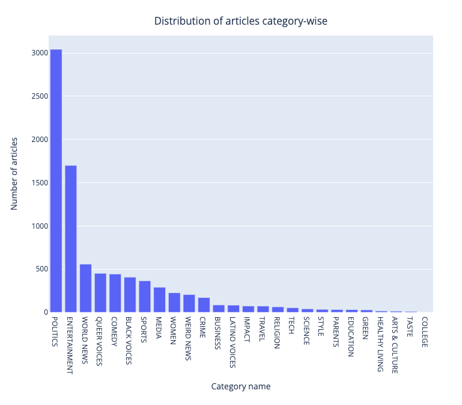
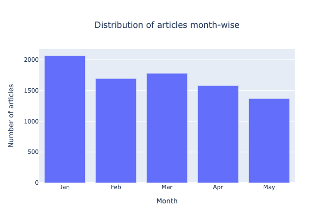
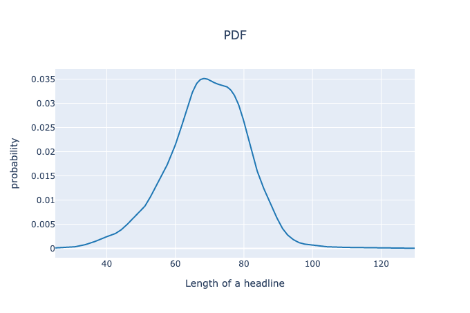

# 01--基于已阅文章的推荐系统

### 信息源：

- Medium--[Recommending news articles based on already read articles](https://towardsdatascience.com/recommending-news-articles-based-on-already-read-articles-627695221fe8)
- Kaggle--[Recommending news articles based on read articles](https://www.kaggle.com/code/vikashrajluhaniwal/recommending-news-articles-based-on-read-articles/notebook)
- Dataset--[News Category Dataset](https://www.kaggle.com/rmisra/news-category-dataset)

## Recommending news articles based on already read articles

由于在你最喜欢的在线平台上很容易获得大量的物品，如电子商务、工作门户网站、食品配送、音乐或视频流，要快速找到你所选择的理想项目是非常困难和耗时的。这些平台可以帮助你，通过分析你过去与系统的互动或行为，根据你的兴趣和偏好推荐项目。

从亚马逊到Linkedin，从Uber eats到Spotify，从Netflix到Facebook，推荐系统被最广泛地用于向用户推荐 "类似物品"、"相关工作"、"首选食品"、"感兴趣的电影 "等。

具有适当项目建议的推荐系统有助于促进销售，增加收入，留住客户，也增加了竞争优势。基本上有两种推荐方法：

1. Content-based recommendation;
2. Collaborative filtering;

**基于内容的推荐是基于用户/物品之间通过其属性获得的相似性**。它使用关于用户或项目的额外信息（元数据），也就是说，它依赖于什么样的内容是已经存在的。这种元数据可以是用户的人口统计信息，如年龄、性别、工作、地点、技能组合等。同样，对于项目，它可以是项目名称、规格、类别、注册日期等。

因此，核心思想是根据相关物品/用户的属性，通过寻找类似的物品/用户来推荐物品。

在这篇博客中，我们将讨论使用新闻类别数据集的基于内容的推荐。我们的目标是通过使用文章标题、类别、作者和出版日期等属性来推荐与已读文章相似的新闻文章。

因此，让我们使用Kaggle上的[新闻类别数据集](https://www.kaggle.com/rmisra/news-category-dataset)开始吧。该数据集包含约20万个观察值，包括6个不同的特征，如新闻标题、类别、作者、简短描述、发布日期等。

### 1、数据预处理

- 只获取2018年的文章--由于数据集的规模相当大，所以处理整个数据集可能会消耗太多的时间。为了避免这种情况，我们只考虑2018年的最新文章。
- 删除所有短标题的文章--在删除标题中的停顿词后，标题很短的文章可能会变成空白标题的文章。因此，让我们删除所有标题中字数较少（<5）的文章。
- 检查并删除所有重复的内容 - 因为有些文章的标题完全相同，所以让我们删除所有这些标题重复出现的文章。

### 2、基本的数据探索

- 基本统计 - 文章数量、作者、类别

  经过数据预处理后，有892名作者的8485篇新闻文章，涉及26个不同的类别。

- 文章的类别分布

  

  

- 每个月的文章数量

  

  从柱状图中，我们可以看到，1月的文章数量最多，然后是3月，依此类推。

- PDF为标题的长度

  

### 3、文本处理

- 删除止损词--止损词对分析没有什么帮助，而且在处理过程中包含止损词也会消耗很多时间，所以我们要把这些止损词删除。
- Lemmatization - 让我们找到单词的基本形式（lemma）来考虑与lemma相同的单词的不同转折。

### 4、基于标题的新文章的相似度

